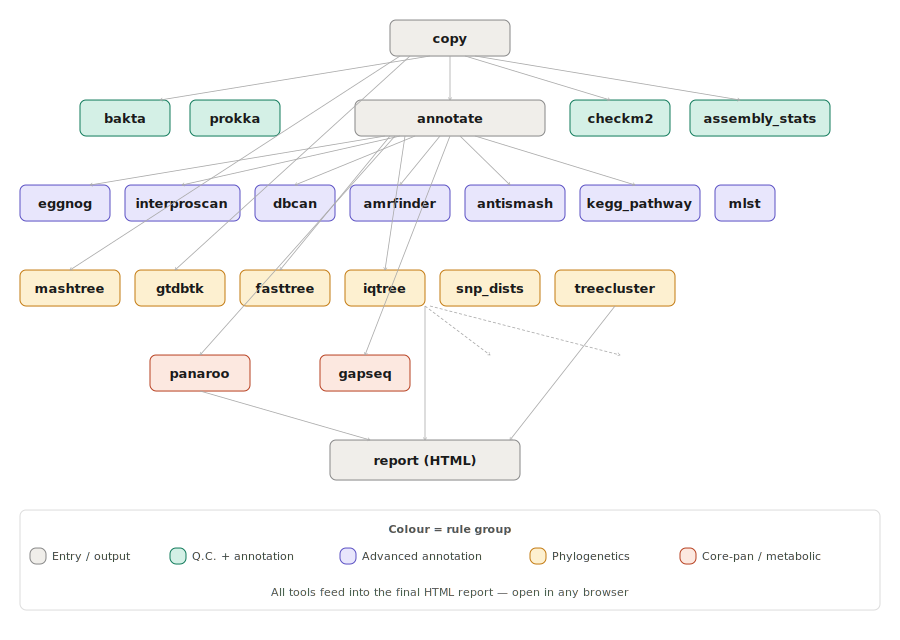
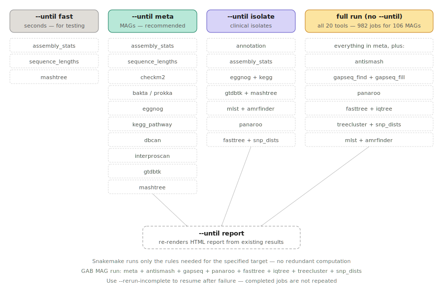

# CompareM2 Setup Guide — taxonomy_bundle GAB MAGs
## March 2026 | 106 MAG Run on Precision Tower 7810 (Ubuntu)

This guide documents the complete installation, configuration, troubleshooting,
and working run procedure for CompareM2 v2.16.2 within the taxonomy_bundle pixi
multi-environment project. It is written for reproducibility on this workstation
and as a reference for others cloning the repository.

---

## 1. Overview

CompareM2 is a Snakemake-based genomes-to-report pipeline. In this project it is
installed as a pixi feature environment (`env-cm2`) rather than globally, allowing
it to coexist with 11 other environments in the same `pixi.toml`.

### What CompareM2 does

| Rule group | Tools included |
|---|---|
| Q.C. | CheckM2, assembly-stats, sequence lengths |
| Annotate | Prokka, Bakta |
| Advanced annotate | eggNOG, dbCAN, AntiSMASH, AMRFinder, MLST, KEGG, InterProScan |
| Phylogenetic | GTDB-Tk, Mashtree, FastTree, IQ-TREE, SNP-dists |
| Core-pan | Panaroo |

### Pseudo-rules (shortcuts for running subsets)

| Pseudo-rule | What it runs |
|---|---|
| `fast` | Quick rules only (assembly-stats, sequence-lengths) — completes in seconds |
| `meta` | Rules relevant for MAGs — the recommended starting point for metagenomes |
| `isolate` | Rules relevant for clinical isolates |
| `downloads` | Download all databases |
| `report` | Re-render the HTML report only |

### Pipeline overview — all 20 tools and their dependencies

The diagram below shows how all tools connect. Colour encodes the rule group.
`copy` is the entry point; `report` is the final output. All other tools feed
into the report either directly or through downstream dependencies.

<p align="center">

</p>

> If the SVG does not render, view the raw file at
> `docs/figures/comparem2_pipeline_overview.svg`

### Choosing what to run — the --until pseudo-rules

Use `--until` to run only the tools you need. The diagram below shows which
tools each pseudo-rule activates. The GAB MAG run used the full set (no
`--until`) which runs all 982 jobs across 106 MAGs.

<p align="center">

</p>

### Architecture — important for troubleshooting

- The `comparem2` CLI wrapper calls Snakemake internally
- Each tool rule has a `conda:` directive pointing to a pre-built conda environment
- Those conda environments live **inside** the Singularity container image at `/conda-envs/`
- Snakemake runs each tool by activating the correct `/conda-envs/<hash>/` inside the container
- The correct profile flags are therefore `use-conda: true` AND `use-singularity: true` together
- The pixi environment provides only `snakemake` and `comparem2` itself — all tool execution happens inside the container

---

## 2. pixi.toml Configuration

### 2.1 Feature and Environment

```toml
[feature.comparem2-stack.dependencies]
python = "3.10.*"
comparem2 = ">=2.16.2"
apptainer = "*"
snakemake = { version = "*", channel = "bioconda" }
r-base = "*"
# r-base is required for the HTML report subpipeline.
# NOTE: The report subpipeline is spawned via /usr/bin/bash (system shell)
# and will fail to find Rscript unless R is also installed system-wide:
#   sudo apt install r-base
# The main analysis pipeline (982 jobs) runs independently of the report.

[feature.comparem2-stack.activation.env]
EXTERNAL_VAULT      = "${EXTERNAL_VAULT:-$PIXI_PROJECT_ROOT/db_local}"
COMPAREM2_DATABASES = "$EXTERNAL_VAULT/comparem2_db"
CHECKM2DB           = "$PIXI_PROJECT_ROOT/db_link/checkm2"
GTDBTK_DATA_PATH    = "$PIXI_PROJECT_ROOT/db_link/gtdbtk"
BAKTA_DB            = "$PIXI_PROJECT_ROOT/db_link/bakta"
BUSCO_LINEAGE_SETS  = "$PIXI_PROJECT_ROOT/db_link/busco"
COMPAREM2_PROFILE   = "$PIXI_PROJECT_ROOT/.pixi/envs/env-cm2/share/comparem2-2.16.2-0/profile/apptainer/default"

[environments]
env-cm2 = { features = ["comparem2-stack"], no-default-feature = true }
```

> **Note on `COMPAREM2_PROFILE` path:** The version string `2.16.2-0` is hardcoded.
> If CompareM2 is upgraded, this path must be updated to match the new version.
> Verify with: `ls ~/.pixi/envs/env-cm2/share/`

### 2.2 Run Task

```toml
[tasks.cm2-run]
# Usage: pixi run -e env-cm2 cm2-run
#
# Bind paths — edit to match your local drive layout before running.
# Example bind paths used during development:
#   /media/bharat/volume1 = databases vault drive (EggNOG, AntiSMASH, DBCan etc.)
#   /media/bharat/volume2 = MAG input data drive (raw .fa files)
# Replace these with your own mount points if different.
cmd = """
  echo "=== CompareM2 Pre-flight ===" &&
  echo "  Profile   : $COMPAREM2_PROFILE" &&
  echo "  Config    : $PIXI_PROJECT_ROOT/config/config_comparem2.yaml" &&
  echo "  Databases : $COMPAREM2_DATABASES" &&
  echo "  Output dir: $EXTERNAL_VAULT/comparem2_GAB_106bins" &&
  echo "  Input glob: /media/bharat/volume2/MAGS_2023_Metawrap_final/MAGS_2023/5_BIN_REFINEMENT/metawrap_70_10_bins/*.fa" &&
  echo "" &&
  mkdir -p "$EXTERNAL_VAULT/comparem2_GAB_106bins" &&
  comparem2 \
    --config \
      input_genomes="/media/bharat/volume2/MAGS_2023_Metawrap_final/MAGS_2023/5_BIN_REFINEMENT/metawrap_70_10_bins/*.fa" \
      output_directory="$EXTERNAL_VAULT/comparem2_GAB_106bins" \
    --configfile "$PIXI_PROJECT_ROOT/config/config_comparem2.yaml"
"""
[tasks.cm2-run.env]
COMPAREM2_BASE      = "$PIXI_PROJECT_ROOT/.pixi/envs/env-cm2/share/comparem2-2.16.2-0"
COMPAREM2_DATABASES = "$EXTERNAL_VAULT/comparem2_db"
COMPAREM2_PROFILE   = "$PIXI_PROJECT_ROOT/.pixi/envs/env-cm2/share/comparem2-2.16.2-0/profile/apptainer/default"
PATH                = "$PIXI_PROJECT_ROOT/.pixi/envs/env-cm2/bin:$PATH"
```

> **Important:** CompareM2 does not accept `--input` or `--output` flags.
> All parameters are passed via `--config KEY=VALUE`. The correct flags are
> `input_genomes=` and `output_directory=`.

---

## 3. config/config_comparem2.yaml

```yaml
# CompareM2 Configuration — taxonomy_bundle GAB 106 MAGs
# March 2026
# NOTE: All absolute paths below must be set to match your local vault.
# They are intentionally not committed with real paths.

annotator: "bakta"

# Output directory — relative path safe here; override via --config at runtime
# Example absolute path: "/media/youruser/volume1/databases/comparem2_GAB_106bins"
output_directory: "results_comparem2"

# --- Bakta ---
set_bakta--meta: ""                    # Essential for MAGs — activates metagenome mode
set_bakta--translation-table: 11
set_bakta--gram: "\"?\""

# --- EggNOG ---
# Example: "/media/youruser/volume1/databases/eggnog"
set_eggnog--data_dir: "SET_IN_LOCAL_ENV"
set_eggnog-m: diamond

# --- AntiSMASH ---
# Example: "/media/youruser/volume1/databases/antismash"
set_antismash--databases: "SET_IN_LOCAL_ENV"

# --- DBCan ---
# Example: "/media/youruser/volume1/databases/comparem2_db/cm2_v2.16/dbcan"
set_dbcan--db_dir: "SET_IN_LOCAL_ENV"

# --- AMRFinder: not set ---
# Let bakta use its container-bundled version to avoid version mismatch.
# Only uncomment if you have confirmed a matching database version.
# set_amrfinder--database: "SET_IN_LOCAL_ENV"

# --- Trees ---
set_fasttree-gtr: ""
set_iqtree--boot: 100
set_iqtree-m: GTR
set_mashtree--genomesize: 5000000

# --- Prokka (fallback annotator) ---
set_prokka--kingdom: bacteria
set_prokka--compliant: ""
```

> **`SET_IN_LOCAL_ENV` sentinel:** If someone clones the repo and runs without
> configuring these paths, CompareM2 will fail with a clear path error pointing
> to that string rather than silently using a wrong path.

---

## 4. Snakemake Profile — CRITICAL CHANGES

The profile at:
```
.pixi/envs/env-cm2/share/comparem2-2.16.2-0/profile/apptainer/default/config.yaml
```

**WARNING:** This file is inside the pixi environment and will be overwritten
if you run `pixi install -e env-cm2` after a CompareM2 upgrade. Re-apply these
changes after any upgrade.

### Working profile content:

```yaml
# Resources
cores: all

# Policies
keep-going: true
keep-incomplete: false
rerun-triggers: "mtime"
rerun-incomplete: true

# Apptainer
# IMPORTANT: Both use-conda AND use-singularity must be true together.
# CompareM2 tools run inside pre-built conda envs at /conda-envs/ inside
# the Singularity container. use-conda activates those envs; use-singularity
# runs everything inside the container. Neither works alone.
use-conda: true
use-singularity: true
singularity-prefix: '~/.comparem2/singularity-prefix'

# Bind paths — edit to match your drive layout.
#
# What "bind" means for biology users:
#   The Singularity container is like a sealed box containing all the tools.
#   By default it cannot see your databases or your MAG files because they
#   live outside the box. The --bind flag opens a window into specific
#   directories on your drives so the tools inside can read and write them.
#
# Three paths are bound here:
#   1. /media/bharat/volume1  — your main databases drive
#      (example path used during development; replace with your own mount)
#   2. /media/bharat/volume2  — your MAG input data drive
#      (example path used during development; replace with your own mount)
#   3. The third path is the AntiSMASH special fix — see Section 6.
#      It mounts a writable copy of the antismash conda environment OVER
#      the read-only version inside the container, so antismash can write
#      its required classifier files on first run.
#      Format: /path/to/writable/copy:/path/inside/container
#
# Example from development machine (replace paths to match your system):
#   /media/bharat/volume1/tmp/antismash_conda_env  = writable copy on your drive
#   /conda-envs/3e17ccfe4ba16146395d22ee67a2b4bf   = fixed path inside container
singularity-args: '--bind /media/bharat/volume1,/media/bharat/volume2,/media/bharat/volume1/tmp/antismash_conda_env:/conda-envs/3e17ccfe4ba16146395d22ee67a2b4bf'

# Local workstation
resources:
  - mem_mb=256000
```

### Key changes from the original profile:

| Setting | Original | Changed to | Reason |
|---|---|---|---|
| `use-conda` | `true` | `true` | Must stay true — tools use conda envs inside container |
| `singularity-args` | `'--bind "$COMPAREM2_BASE","$COMPAREM2_DATABASES",...'` | hardcoded absolute paths | Env vars in single-quoted YAML don't expand at runtime; hardcoded paths are reliable |
| `conda-prefix` | not set | not set | Setting this to `/conda-envs` causes PermissionError on host |
| antismash bind | not present | writable env overlay added | AntiSMASH needs to write classifier files on first run but the container is read-only |

---

## 5. Database Structure

CompareM2 expects databases at `$COMPAREM2_DATABASES/cm2_v2.16/<tool>/` with
a flag file and a `db/` subdirectory containing the actual data.

### 5.0 Vault databases reused by CompareM2

These databases were already present in the vault from previous projects and
are reused by CompareM2 via symlinks rather than re-downloading:

| Tool | Vault path | Approx. size |
|---|---|---|
| Bakta | `/media/bharat/volume1/databases/bakta/` | ~90 GB |
| CheckM2 | `/media/bharat/volume1/databases/checkm2/` | ~3 GB |
| EggNOG | `/media/bharat/volume1/databases/eggnog/` | ~50 GB |
| AntiSMASH | `/media/bharat/volume1/databases/antismash/` | ~2 GB |
| GTDB-Tk | `/media/bharat/volume1/databases/gtdb_226/` | ~66 GB |
| AMRFinder | inside Bakta directory | ~1 GB |
| DBCan | downloaded separately — see Section 5.6 | ~11 GB |

### 5.1 One-shot symlink and flag file creation script

Run this once on a new machine to set up all vault databases for CompareM2.
Replace the vault path with your own `EXTERNAL_VAULT` location:

```bash
# Example vault path used during development:
# /media/bharat/volume1/databases
# Replace with your own path — e.g. /media/youruser/volume1/databases

CM2_DB="/media/bharat/volume1/databases/comparem2_db/cm2_v2.16"

# Create directory structure
mkdir -p $CM2_DB/{bakta,checkm2,eggnog,dbcan,antismash,gtdb,amrfinder}

# Bakta
ln -sfn /media/bharat/volume1/databases/bakta       $CM2_DB/bakta/db
touch   $CM2_DB/bakta/comparem2_bakta_database_representative.flag

# CheckM2
ln -sfn /media/bharat/volume1/databases/checkm2/CheckM2_database \
                                                    $CM2_DB/checkm2/CheckM2_database
touch   $CM2_DB/checkm2/comparem2_checkm2_database_representative.flag

# EggNOG
ln -sfn /media/bharat/volume1/databases/eggnog      $CM2_DB/eggnog/db
touch   $CM2_DB/eggnog/comparem2_eggnog_database_representative.flag

# AntiSMASH
ln -sfn /media/bharat/volume1/databases/antismash   $CM2_DB/antismash/db
touch   $CM2_DB/antismash/comparem2_antismash_database_representative.flag

# GTDB-Tk — two steps: db/ symlink AND release226/ symlink
ln -sfn /media/bharat/volume1/databases/gtdb_226    $CM2_DB/gtdb/db
ln -sfn $CM2_DB/gtdb/db                             $CM2_DB/gtdb/release226
touch   $CM2_DB/gtdb/comparem2_gtdb_database_representative.flag

# AMRFinder (inside Bakta directory)
ln -sfn /media/bharat/volume1/databases/bakta/amrfinderplus-db \
                                                    $CM2_DB/amrfinder/db
touch   $CM2_DB/amrfinder/comparem2_amrfinder_database_representative.flag

echo "Vault database symlinks created:"
find $CM2_DB -name "*.flag" | sort
```

> **Why symlinks?** CompareM2 checks for a flag file to know if a database
> is installed. By creating the flag file and a symlink pointing to your
> existing database, you tell CompareM2 "this is already here" without
> re-downloading hundreds of gigabytes of data you already have.

### Verify all flag files exist

```bash
find /media/bharat/volume1/databases/comparem2_db/cm2_v2.16 -name "*.flag" | sort
```

Expected output:
```
.../amrfinder/comparem2_amrfinder_database_representative.flag
.../antismash/comparem2_antismash_database_representative.flag
.../bakta/comparem2_bakta_database_representative.flag
.../checkm2/comparem2_checkm2_database_representative.flag
.../dbcan/comparem2_dbcan_database_representative.flag
.../eggnog/comparem2_eggnog_database_representative.flag
.../gtdb/comparem2_gtdb_database_representative.flag
```


### 5.2 DBCan — downloaded via pixi task (not in vault)
```
comparem2_db/cm2_v2.16/dbcan/
├── comparem2_dbcan_database_representative.flag
├── CAZyDB.07242025.fa
├── dbCAN.hmm
└── ... (all database files at top level, no db/ subdirectory)
```

DBCan is the only database not already in the vault. Download it via:
```bash
pixi run download-dbcan
```

> ⚠️ **March 2026 status:** The primary DBCan server (bcb.unl.edu) is offline
> due to a cyberattack. The `download-dbcan` task uses the AWS S3 backup instead.
> When the server is restored, CompareM2's built-in `--until downloads` will work.

**Manual AWS S3 download (if pixi task fails):**
```bash
mkdir -p /media/bharat/volume1/databases/comparem2_db/cm2_v2.16/dbcan
cd /media/bharat/volume1/databases/comparem2_db/cm2_v2.16/dbcan

# Install AWS CLI if needed
pip install awscli --break-system-packages

# Download (~11GB)
aws s3 cp s3://dbcan/db_v5-2_9-13-2025/ . --recursive --no-sign-request

# Clean up any incomplete partial files and create flag
find . -name '*.[A-Z0-9][A-Z0-9][A-Z0-9][A-Z0-9][A-Z0-9][A-Z0-9][A-Z0-9][A-Z0-9]' -delete
touch comparem2_dbcan_database_representative.flag
```

### 5.3 Bakta — has db/ subdirectory
```
comparem2_db/cm2_v2.16/bakta/
├── comparem2_bakta_database_representative.flag
└── db/
    ├── bakta.db
    ├── version.json
    ├── amrfinderplus-db/
    └── ... (all bakta database files)
```
Bakta v1.11.4 (in container), database v6.0 (2025-02-24) — compatible.

> **Important:** Do NOT set `set_bakta--db` in `config_comparem2.yaml`.
> CompareM2 finds bakta via the flag file symlink automatically. Setting
> `set_bakta--db` causes `--db` to be passed twice to bakta, which causes errors.

### 5.4 CheckM2 — required symlink (non-standard structure)
The Snakefile constructs the database path as `dirname(flag_file)/CheckM2_database/`.
The actual database subdirectory must match this exactly:
```bash
# Example from development machine:
ln -sfn /media/bharat/volume1/databases/checkm2/CheckM2_database \
        /media/bharat/volume1/databases/comparem2_db/cm2_v2.16/checkm2/CheckM2_database
```

### 5.5 GTDB-Tk — two symlinks required
The Snakefile appends `/release226/` to construct the database path, but the
data was downloaded as a plain `db/` directory. Two symlinks are needed:
```bash
# db/ symlink (standard pattern)
ln -sfn /media/bharat/volume1/databases/gtdb_226 \
        /media/bharat/volume1/databases/comparem2_db/cm2_v2.16/gtdb/db

# release226/ symlink (what GTDB-Tk actually reads)
ln -sfn /media/bharat/volume1/databases/comparem2_db/cm2_v2.16/gtdb/db \
        /media/bharat/volume1/databases/comparem2_db/cm2_v2.16/gtdb/release226
```
Verify: `ls .../gtdb/release226/` should show `markers  masks  metadata  mrca_red  msa  pplacer  radii  skani  split  taxonomy`

### 5.6 EggNOG, AntiSMASH, AMRFinder
These follow the standard `flag + db/` pattern. Verify each with:
```bash
ls /media/bharat/volume1/databases/comparem2_db/cm2_v2.16/<tool>/db/
```

---

### 5.7 EggNOG, AntiSMASH, AMRFinder
These follow the same `flag + db/` pattern and were populated by CompareM2's
own download tasks. Verify each with:
```bash
ls /media/bharat/volume1/databases/comparem2_db/cm2_v2.16/<tool>/db/
```

---

## 6. AntiSMASH Special Setup — Writable Environment Fix

AntiSMASH is the most complex tool to set up in this pipeline. This section
explains what the problem is, why it occurs, and the exact steps used to fix it.

### 6.1 What the problem is

AntiSMASH needs to generate machine learning classifier files (`.pkl` files)
the first time it runs. These files are specific to the version of scikit-learn
installed alongside antismash. The problem is that antismash tries to write
these files back into its own installation directory — which in our case is
inside the read-only Singularity container. The container filesystem cannot
be written to, so antismash fails with:

```
OSError: [Errno 30] Read-only file system:
'/conda-envs/3e17ccfe4ba16146395d22ee67a2b4bf/lib/python3.11/
site-packages/antismash/modules/lanthipeptides/data/lanthipeptide.scaler.pkl'
```

### 6.2 Why simple fixes don't work

Several approaches were tried and failed before finding the working solution:

- `--writable-tmpfs` — the temporary RAM overlay runs out of space
- `--overlay` with an ext3 image — fails with permission denied on the pixi session directory
- `--fakeroot` — requires `uidmap` package and `newuidmap` to be installed
- Setting `APPTAINER_TMPDIR` — pixi overrides the session directory internally

### 6.3 System prerequisite

Install `uidmap` for future fakeroot support (good practice regardless):
```bash
sudo apt update
sudo apt install uidmap
```

### 6.4 The working fix — writable environment copy

The solution is to copy the entire antismash conda environment out of the
read-only container to a writable location on your databases drive, run the
classifier generation there, then permanently bind-mount that writable copy
over the read-only original inside the container.

**Step 1 — Copy the antismash conda environment out of the container**

The antismash environment lives at `/conda-envs/3e17ccfe4ba16146395d22ee67a2b4bf/`
inside the container. Copy it to your databases drive:

```bash
# Example destination used during development:
# /media/bharat/volume1/tmp/antismash_conda_env
# Replace /media/bharat/volume1 with your own databases drive mount point

mkdir -p /media/bharat/volume1/tmp/antismash_conda_env

pixi run -e env-cm2 bash -c "
  singularity exec \
    --bind /media/bharat/volume1 \
    ~/.comparem2/singularity-prefix/c7a548fe483c2be379c66179c79be5db.simg \
    cp -r /conda-envs/3e17ccfe4ba16146395d22ee67a2b4bf/. \
          /media/bharat/volume1/tmp/antismash_conda_env/
"
```

This copies approximately 2-3GB of data. The destination path on your drive
(`/media/bharat/volume1/tmp/antismash_conda_env`) is writable, unlike the
path inside the container.

**Step 2 — Run prepare-data using the writable copy**

Now run antismash inside the container but with the writable copy bind-mounted
OVER the original read-only path. This tricks antismash into writing its
classifier files to your drive instead of into the container:

```bash
# Note: the --bind argument here has a special format:
#   /path/on/your/drive:/path/inside/container
# This mounts your writable copy at the same location antismash expects

pixi run -e env-cm2 bash -c "
  singularity exec \
    --bind /media/bharat/volume1 \
    --bind /media/bharat/volume1/tmp/antismash_conda_env:/conda-envs/3e17ccfe4ba16146395d22ee67a2b4bf \
    --env PATH=/conda-envs/3e17ccfe4ba16146395d22ee67a2b4bf/bin:/opt/conda/bin:/usr/local/sbin:/usr/local/bin:/usr/sbin:/usr/bin:/sbin:/bin \
    ~/.comparem2/singularity-prefix/c7a548fe483c2be379c66179c79be5db.simg \
    /conda-envs/3e17ccfe4ba16146395d22ee67a2b4bf/bin/antismash \
      --prepare-data \
      --databases /media/bharat/volume1/databases/comparem2_db/cm2_v2.16/antismash/db \
  2>&1
"
```

You will see some warnings about MEME version and missing MIBiG files — these
are expected and do not prevent antismash from running. The important thing is
that the lanthipeptide read-only error is gone.

**Step 3 — Verify the classifier files were generated**

```bash
find /media/bharat/volume1/tmp/antismash_conda_env \
  -name "lanthipeptide*.pkl" -o -name "*.scaler.pkl" 2>/dev/null
```

You should see five files:
- `lanthipeptide.scaler.pkl`
- `lanthipeptide.classifier.pkl`
- `lassopeptide.scaler.pkl`
- `sactipeptide.scaler.pkl`
- `thiopeptide.scaler.pkl`

**Step 4 — Add the permanent bind mount to the profile**

Edit the profile (see Section 4) and ensure `singularity-args` includes the
antismash bind mount as the third bind path. This must be present every time
the pipeline runs, not just during prepare-data.

### 6.5 Known remaining warnings

After the fix, antismash will still report two warnings on every run:

- `Incompatible MEME version, expected 4.11.2 but found 5.5.8` — the CASSIS
  module (fungal gene cluster detection) is incompatible. This does not affect
  bacterial BGC detection which is what we need for GAB MAGs.
- `Failed to locate cluster definition file: .../clustercompare/mibig/3.1/data.json`
  — the MIBiG comparison database is incomplete. Core antismash BGC detection
  is not affected.

These warnings are cosmetic for bacterial MAG analysis and can be ignored.


## 7. Running the Pipeline

### 7.1 Verify Snakemake version
```bash
pixi run -e env-cm2 snakemake --version
# Expected: 7.32.4
```

### 7.2 Verify CompareM2 version
```bash
pixi run -e env-cm2 conda list comparem2
# Expected: comparem2  2.16.2  hdfd78af_0  bioconda
# Note: The banner shows v2.16.1 — this is a cosmetic bug in the wrapper script.
# The installed package is correctly 2.16.2.
```

### 7.3 Dry run (always do this first)
```bash
pixi run -e env-cm2 bash -c "
  export PATH=/home/bharat/software/taxonomy_bundle/.pixi/envs/env-cm2/bin:\$PATH &&
  comparem2 \
    --config \
      input_genomes='/media/bharat/volume2/MAGS_2023_Metawrap_final/MAGS_2023/5_BIN_REFINEMENT/metawrap_70_10_bins/*.fa' \
      output_directory='/media/bharat/volume1/databases/comparem2_GAB_106bins' \
    --configfile '/home/bharat/software/taxonomy_bundle/config/config_comparem2.yaml' \
    --dry-run
"
# Expected: 982 jobs across 106 MAGs
```

### 7.4 Full run (in tmux to survive disconnection)
```bash
tmux new -s cm2
pixi run -e env-cm2 bash -c "
  export PATH=/home/bharat/software/taxonomy_bundle/.pixi/envs/env-cm2/bin:\$PATH &&
  comparem2 \
    --config \
      input_genomes='/media/bharat/volume2/MAGS_2023_Metawrap_final/MAGS_2023/5_BIN_REFINEMENT/metawrap_70_10_bins/*.fa' \
      output_directory='/media/bharat/volume1/databases/comparem2_GAB_106bins' \
    --configfile '/home/bharat/software/taxonomy_bundle/config/config_comparem2.yaml'
"
# Detach: Ctrl+B then D
```

### 7.5 Resume after failure
```bash
pixi run -e env-cm2 bash -c "
  export PATH=/home/bharat/software/taxonomy_bundle/.pixi/envs/env-cm2/bin:\$PATH &&
  comparem2 \
    --config \
      input_genomes='/media/bharat/volume2/MAGS_2023_Metawrap_final/MAGS_2023/5_BIN_REFINEMENT/metawrap_70_10_bins/*.fa' \
      output_directory='/media/bharat/volume1/databases/comparem2_GAB_106bins' \
    --configfile '/home/bharat/software/taxonomy_bundle/config/config_comparem2.yaml' \
    --rerun-incomplete
"
```

### 7.6 Check status
```bash
pixi run -e env-cm2 comparem2 --status
```

---

## 8. Staged Running (--until)

CompareM2 supports running subsets via `--until`. For MAG datasets, the `meta`
pseudo-rule covers the core analyses:

```
meta includes: annotation, assembly-stats, sequence_lengths, checkm2,
               eggnog, kegg_pathway, dbcan, interproscan, gtdbtk, mashtree
```

Stage 1 — core MAG analyses:
```bash
comparem2 --config input_genomes="..." output_directory="..." --until meta
```

Stage 2 — additional analyses:
```bash
comparem2 --config input_genomes="..." output_directory="..." \
  --until antismash gapseq_find gapseq_fill panaroo fasttree iqtree treecluster snp_dists amrfinder
```

Stage 3 — report only:
```bash
comparem2 --config output_directory="..." --until report
```

Snakemake's `rerun-triggers: mtime` means each stage picks up exactly where
the previous one left off with no recomputation of completed jobs.

### 8.1 Run specific rules only

```bash
# Q.C. only (fast — minutes)
comparem2 --config input_genomes="path/to/genomes/*.fa" output_directory="results" \
    --until checkm2 assembly_stats

# Annotation only
comparem2 --config input_genomes="path/to/genomes/*.fa" output_directory="results" \
    --until bakta

# Phylogenetics only
comparem2 --config input_genomes="path/to/genomes/*.fa" output_directory="results" \
    --until gtdbtk mashtree

# Re-render report only (after analyses are complete)
comparem2 --config output_directory="results" --until report
```

### 8.2 Use a file-of-filenames (FOFN) instead of glob

For large datasets or when genomes are spread across directories, a FOFN
(file of file names) is cleaner than a glob pattern:

```bash
# Create the FOFN — one genome path per line
ls /path/to/your/bins/*.fa > my_genomes_fofn.txt

# Run using the FOFN
comparem2 --config fofn="my_genomes_fofn.txt" output_directory="results" \
    --configfile config/config_comparem2.yaml
```

Individual lines in the FOFN can be commented out with `#` to exclude specific
genomes without recreating the file.

---

## 9. Output Files

All outputs are written to `output_directory/` (default: `results_comparem2/`).

| File | Description |
|---|---|
| `report_<title>.html` | Main HTML report — open in any browser |
| `checkm2/quality_report.tsv` | Completeness and contamination for all genomes |
| `assembly-stats/assembly-stats.tsv` | N50, contig count, genome size |
| `samples/<n>/bakta/<n>.gff` | Bakta annotation per genome |
| `samples/<n>/bakta/<n>.faa` | Protein sequences per genome |
| `samples/<n>/eggnog/<n>.emapper.annotations` | EggNOG functional annotations |
| `samples/<n>/antismash/<n>.json` | Biosynthetic gene cluster (BGC) predictions |
| `samples/<n>/dbcan/overview.txt` | CAZyme annotations |
| `gtdbtk/gtdbtk.summary.tsv` | GTDB-Tk taxonomy classification |
| `mashtree/mashtree.nwk` | Mash distance tree (Newick format) |
| `fasttree/` | Maximum likelihood tree from core genome alignment |
| `iqtree/` | Bootstrap-supported phylogenetic tree |
| `panaroo/` | Pan/core genome results |
| `benchmarks/` | Runtime benchmarks per rule |
| `metadata.tsv` | Sample metadata summary |
| `version_info.txt` | Software versions used |

---

## 10. Known Issues and Workarounds

### Quick reference troubleshooting table

| Error | Cause | Fix |
|---|---|---|
| `OSError: Read-only file system` in antismash | Pickle files need to be written into read-only container | Follow Section 6 writable env procedure |
| `Rscript: command not found` | Report subpipeline uses system bash, not pixi PATH | `sudo apt install r-base` |
| `Snakemake lock` | Previous run crashed without releasing lock | `rm -rf results/.snakemake/locks/` |
| `double // in path` | Trailing slash on `output_directory` | Remove trailing slash |
| `bakta: database not found` | Symlink missing or `set_bakta--db` set in config | Check symlink; remove `set_bakta--db` from config |
| `GTDB-Tk: reference data does not exist` | Missing `release226/` symlink | Create symlink (Section 5.5) |
| `checkm2: database not found` | Missing `CheckM2_database/` symlink | Create symlink (Section 5.4) |
| `PermissionError: /conda-envs` | `conda-prefix: /conda-envs` set in profile | Remove `conda-prefix` from profile |
| `--latency-wait: invalid int value` | `--output` flag used (not a comparem2 flag) | Use `--config output_directory=` instead |
| `FileNotFoundError: Ecoli_Sample` | Run without `input_genomes=` — defaults to current dir | Always specify `--config input_genomes=` |
| `newuidmap not found` | `uidmap` package not installed | `sudo apt install uidmap` |

### 10.1 HTML report — Rscript not found
The dynamic report subpipeline is spawned via `/usr/bin/bash` (system shell)
and does not inherit the pixi environment PATH. Rscript must be on the system PATH:
```bash
sudo apt install r-base
```
The main analysis pipeline (bakta, checkm2, gtdbtk, eggnog etc.) runs
independently and is not affected by this.

### 10.2 AntiSMASH — read-only filesystem error
AntiSMASH tries to write SVM classifier pickle files into the read-only
Singularity container on first run. Multiple approaches were tried before
finding the working solution. The fix is to copy the antismash conda
environment to a writable location on your databases drive and bind-mount
it over the read-only original. Full procedure in Section 6.

### 10.3 AntiSMASH MEME version warning
AntiSMASH reports `Incompatible MEME version, expected 4.11.2 but found 5.5.8`
on every run. This affects only the CASSIS module (fungal cluster detection)
which is not relevant for bacterial MAGs. The warning can be ignored.

### 10.4 AntiSMASH MIBiG clustercompare warning
AntiSMASH reports missing MIBiG files for clustercompare. Core BGC detection
is not affected. The MIBiG database files would need to be downloaded separately
if clustercompare output is required.

### 10.5 Version banner shows v2.16.1
The comparem2 wrapper script has a hardcoded version string that was not updated
when the package was bumped to 2.16.2 for the bioconda release. The installed
package is correctly 2.16.2 — confirmed via `conda list comparem2`.

### 10.6 Profile is inside the pixi environment
The Snakemake profile at `.pixi/envs/env-cm2/share/comparem2-2.16.2-0/profile/`
will be overwritten by `pixi install` after any CompareM2 upgrade. The working
profile content is documented in Section 4 and must be re-applied after upgrades.

After any CompareM2 upgrade, also check the Snakemake version before re-applying
the profile — the flag names changed between Snakemake 7.x and 8/9.x:
```bash
pixi run -e env-cm2 snakemake --version
```

If it returns 8.x or 9.x, update these keys throughout the profile:

| Snakemake 7.x (current) | Snakemake 8/9.x |
|---|---|
| `use-singularity: true` | `use-apptainer: true` |
| `singularity-args: '...'` | `apptainer-args: '...'` |
| `singularity-prefix: '...'` | `apptainer-prefix: '...'` |

### 10.7 COMPAREM2_BASE not expanding in profile singularity-args
The original profile used `'--bind "$COMPAREM2_BASE","$COMPAREM2_DATABASES",...'`
but environment variables inside single-quoted YAML strings are not expanded by
Snakemake at runtime. The fix is to use hardcoded absolute paths in singularity-args.

### 10.8 AMRFinder — do not set set_amrfinder--database in config
Pointing AMRFinder to an external database causes version mismatch errors with
the bakta version inside the container. Leave it commented out and let bakta
use its bundled AMRFinder database.

---

## 11. Container Information

The Singularity image used by CompareM2:
```
~/.comparem2/singularity-prefix/c7a548fe483c2be379c66179c79be5db.simg
```

Key conda environments inside the container (at `/conda-envs/`):
- `54dddd6c96716032490ac50d79fbfca3` — bakta 1.11.4
- `3e17ccfe4ba16146395d22ee67a2b4bf` — antismash 7
- `bdfdfd3801dae19174ec1853e1ee5c8d` — checkm2

To inspect tools inside the container:
```bash
pixi run -e env-cm2 bash -c "
  singularity exec \
    --bind /media/bharat/volume1 \
    ~/.comparem2/singularity-prefix/c7a548fe483c2be379c66179c79be5db.simg \
    ls /conda-envs/
"
```

---

## 12. Checklist for a New Machine

### System packages (run once as sudo)
- [ ] `sudo apt install uidmap` — required for Singularity fakeroot support
- [ ] `sudo apt install r-base` — required for HTML report generation
- [ ] `sudo apt install tmux` — recommended for long pipeline runs

### Storage and environment setup
- [ ] Set `EXTERNAL_VAULT` in `~/.bashrc` pointing to your large databases drive
  - Example: `export EXTERNAL_VAULT="/media/youruser/volume1/databases"`
- [ ] Run `pixi run setup-vault` to create directory structure
- [ ] Run `pixi install -e env-cm2`

### Profile configuration
- [ ] Edit profile `singularity-args` to match your drive mount points
  - Profile location: `.pixi/envs/env-cm2/share/comparem2-2.16.2-0/profile/apptainer/default/config.yaml`
  - Replace `/media/bharat/volume1` and `/media/bharat/volume2` with your own paths

### Database symlinks
- [ ] Run the one-shot symlink script (Section 5.1) — creates all symlinks and flag files
- [ ] Verify all flag files exist with `find $EXTERNAL_VAULT/comparem2_db -name "*.flag"`

### AntiSMASH writable environment setup
- [ ] Copy antismash env from container (Section 6.4 Step 1)
- [ ] Run `--prepare-data` with writable bind mount (Section 6.4 Step 2)
- [ ] Verify pkl files were generated (Section 6.4 Step 3)
- [ ] Confirm profile `singularity-args` includes the antismash bind (Section 6.4 Step 4)

### Config and verification
- [ ] Update `config/config_comparem2.yaml` with local database paths
  - Replace all `SET_IN_LOCAL_ENV` values with absolute paths on your system
- [ ] Run dry run to verify 982 jobs detected
  ```bash
  pixi run -e env-cm2 bash -c "
    comparem2 \
      --config \
        input_genomes='/path/to/your/bins/*.fa' \
        output_directory='/path/to/your/output' \
      --configfile 'config/config_comparem2.yaml' \
      --dry-run
  "
  ```

